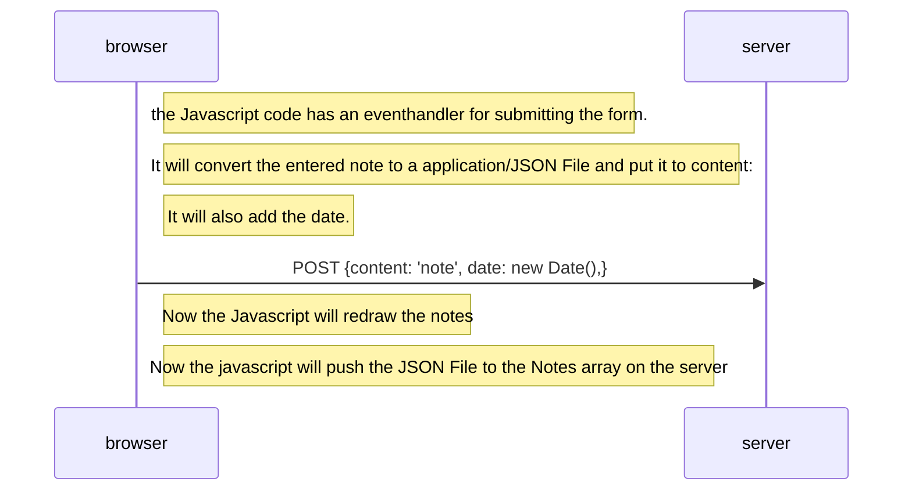

```mermaid
sequenceDiagram
    participant browser
    participant server

    Note right of browser: the Javascript code has an eventhandler for submitting the form.
    Note right of browser: It will convert the entered note to a application/JSON File and put it to content:
    Note right of browser: It will also add the date.

    browser->>server: POST {content: 'note', date: new Date(),}
    activate server

    Note right of browser: Now the Javascript will redraw the notes
    Note right of browser: Now the javascript will push the JSON File to the Notes array on the server

```